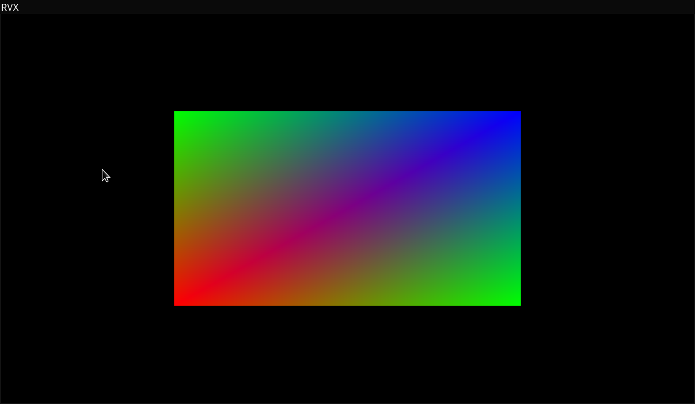

# Rendevox

## Template

### RVX Quad



```cpp
#include "../rendevox-base/rendevox-base.hpp"

int main() {
	Rendevox::Window window = Rendevox::Window("OpenGL", 1280, 720, "RVX", false);

	return 0;
}

void UserUpdate() {
    Rendevox::DrawTriangle(Vector2(-0.5f, -0.5f),
                 Vector2(-0.5f, 0.5f),
                 Vector2(0.5f, 0.5f),
                 Vector3(1.0f, 0.0f, 0.0f),
                 Vector3(0.0f, 1.0f, 0.0f),
                 Vector3(0.0f, 0.0f, 1.0f));
    Rendevox::DrawTriangle(Vector2(0.5f, -0.5f),
                           Vector2(-0.5f, -0.5f),
                           Vector2(0.5f, 0.5f),
                           Vector3(0.0f, 1.0f, 0.0f),
                           Vector3(1.0f, 0.0f, 0.0f),
                           Vector3(0.0f, 0.0f, 1.0f));
}

```

## Structure

- ##### app `User's functions`
- ##### rendevox-base `Core of rendevox`, 
  - ##### includes 
    - `Windowing`
    - `2D Rendering`
    - `Text Rendering`
## Dependencies

#### Install for Windows via [MSYS2](https://repo.msys2.org/distrib/x86_64/) latest version
```shell
$ pacman -S mingw-w64-x86_64-toolchain
$ pacman -S mingw-w64-x86_64-cmake
$ pacman -S mingw-w64-x86_64-glfw
$ pacman -S mingw-w64-x86_64-vulkan-devel
$ pacman -S mingw-w64-x86_64-openal
```

- C++17 compiler
- C++ standard libraries
- CMake
- Glfw
- Vulkan
- OpenAL

## Features
- 2D & 3D rendering
- text rendering
- basic physics
- audio playback

## How to run

1. Create directory `app` and create file `main.cpp` inside
2. Paste code from template

### CLion
- Create `CMake Application` configuration in CLion with `Target` = `All Targets` and `executable` = `rendevox`

### Shell

#### Linux
``` shell
$ run-linux.sh
```

#### Windows - Windows PowerShell
``` shell
$ .\run-win.cmd
```

#### Windows - MSYS2 Mingw64
```
$ cmd <./run-win.cmd
```
